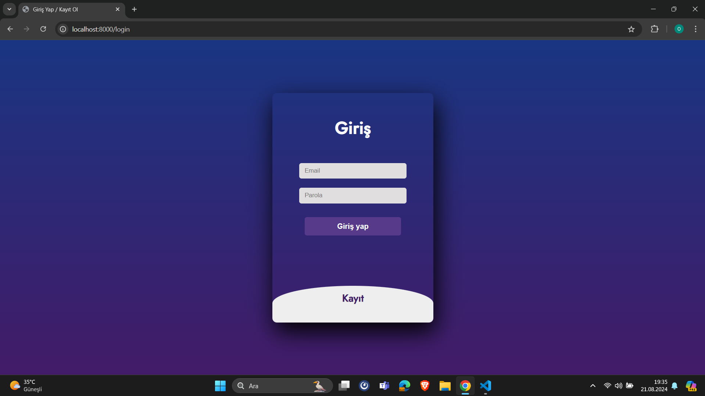
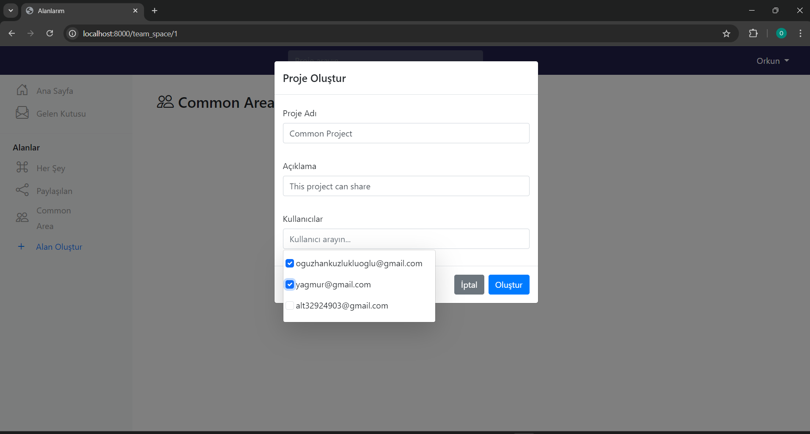
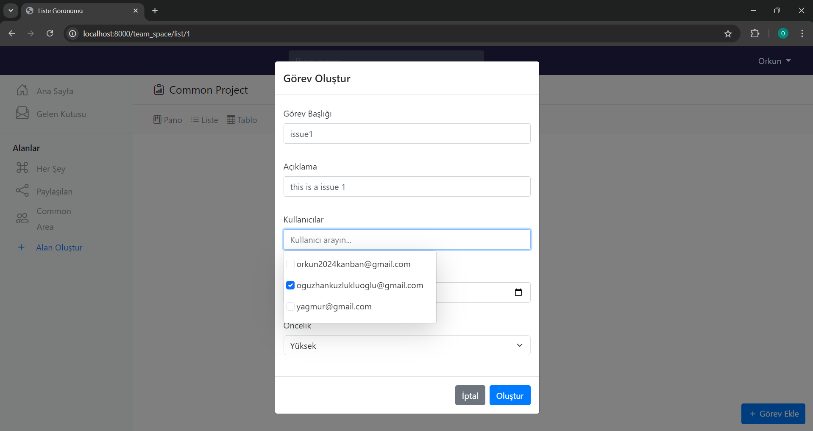
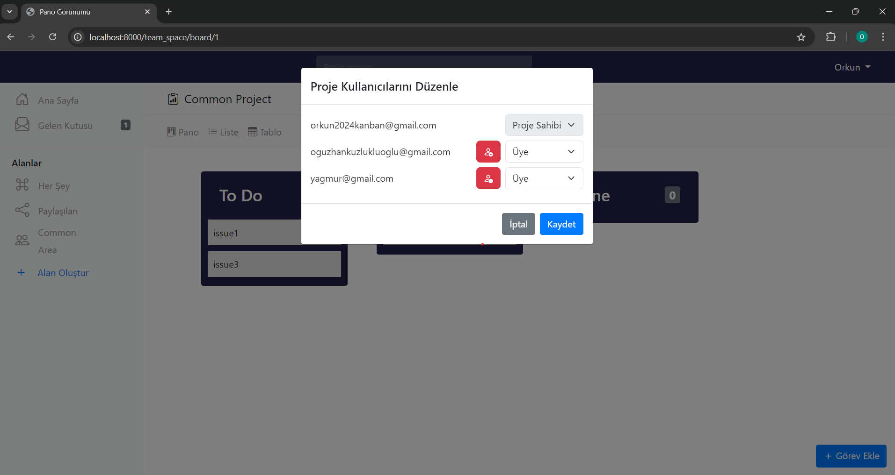
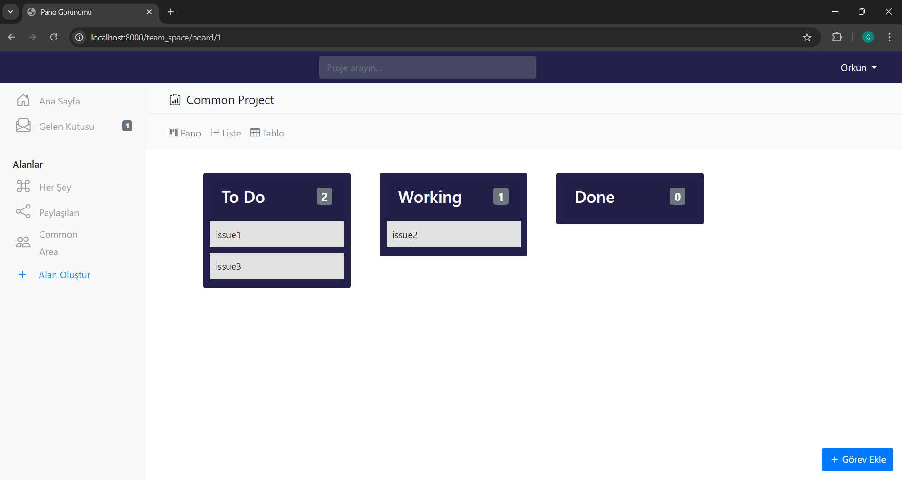
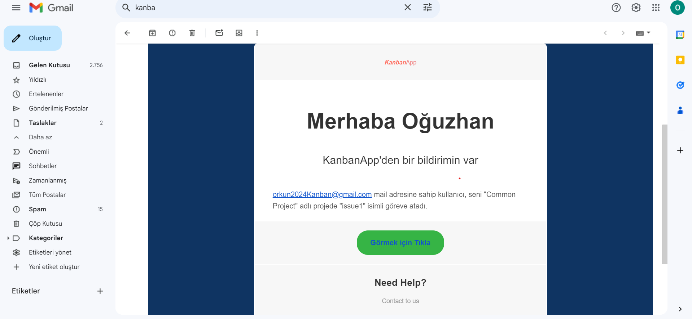
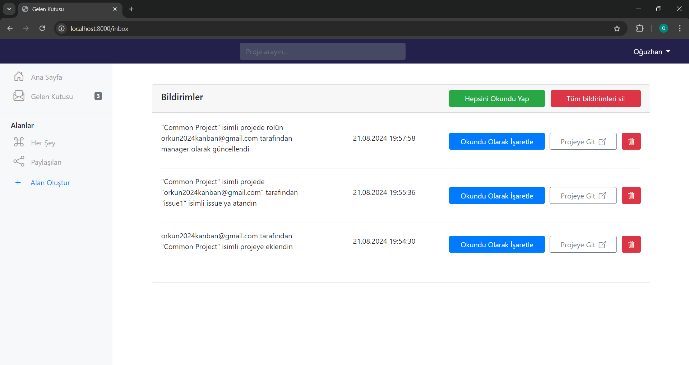
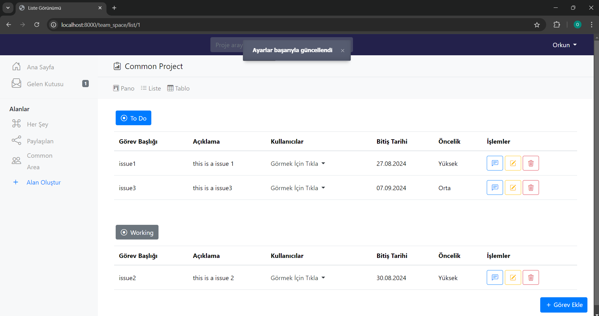

# Project Management Web Application

## Overview

This project is a comprehensive project management web application inspired by platforms like ClickUp and Trello. Built using Go (Golang) with the Gin framework and GORM for ORM, alongside MySQL as the database, it follows the MVC architecture and offers a range of features designed to streamline project management, team collaboration, and issue tracking.

## Key Features

### User and Role Management
- **Role-Based Access Control**: Users can be added to projects with specific roles (e.g., Manager, Owner). 
- **Authorization**: Only authorized users can perform certain actions like editing issues, assigning tasks, or managing team members.

### Project and Issue Management
- **Project Lifecycle**: Users can create, update, and delete projects.
- **Issue Tracking**: Assign issues within projects, track due dates, priorities, and statuses.
- **Flexible Board**: A customizable board section for managing independent issues or todos outside specific projects.

### Notifications and Email Integration
- **Real-Time Notifications**: Instant alerts when significant events occur, such as being added to a project or role changes.
- **Email Integration**: Notifications are handled via SMTP with customizable email templates for clear communication.

### Security and Middleware
- **JWT Authentication**: Secure user sessions with JSON Web Token-based authentication.
- **Authorization Middleware**: Middleware functions ensure only users with the right permissions can access or modify resources.

### Database Management and Migrations
- **Automatic Migrations**: Seamlessly create and update database tables, simplifying maintenance and scaling.
- **Comprehensive Models**: Detailed models for managing users, projects, issues, comments, and notifications.

### Frontend Integration
- **Seamless Data Flow**: The backend integrates smoothly with the frontend, ensuring a consistent user experience.
- **Responsive Design**: Accessible and user-friendly across various devices with improved CSS.

### Advanced Features
- **User Removal Notifications**: Users removed from projects receive an email and are blocked from accessing the project.
- **Custom Dashboard**: Synchronize issues between projects and independent boards for enhanced flexibility.

### Bug Fixing and Optimization
- **Continuous Improvement**: Regular updates and bug fixes to ensure smooth operation.
- **Performance Optimization**: Query tuning and response time reduction based on testing feedback.

## How to Get Started

To get started with the application:
1. Clone the repository from GitHub.
2. Set up your environment variables (e.g., SMTP credentials, database connection).
3. Run the project.

Detailed installation and usage instructions can be found in the README file.

## Future Enhancements

Future plans include:
- **Third-Party Integrations**: Explore the integration of additional services.
- **Customizable Reporting Tools**: Develop more reporting tools tailored to user needs.
- **UI Improvements**: Ongoing enhancements to the user interface based on feedback.

---

### Application Screenshots

